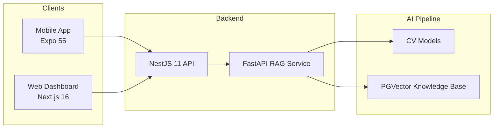
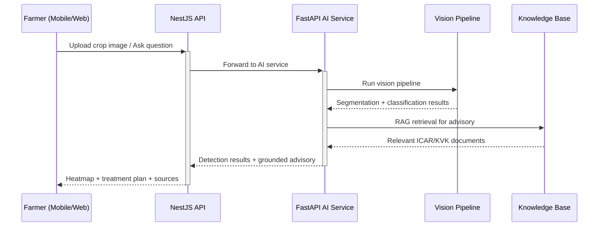

# 🏗️ System Architecture

## High-Level Flow

## Request Flow

## Computer Vision Pipeline

| Stage | Model | Input | Output |
|-------|-------|-------|--------|
| 1. Leaf Segmentation | YOLOv8n-seg | Field image | Individual leaf masks |
| 2. Infection Classification | MobileNetV2 | Cropped leaf | Disease type + confidence |
| 3. Lesion Segmentation | U-Net | Infected leaf | Precise lesion boundaries |
| 4. Spray Planning | Heatmap algorithm | Detection map | 6-lane boom spray pattern |

## Advisory Pipeline

The AI service uses a RAG (Retrieval-Augmented Generation) architecture:
- Verified agricultural knowledge from ICAR, KVK, and CIBRC sources
- Vector similarity search via PGVector
- Grounded responses with explicit source citations and confidence scores
- Safety boundary: abstains and routes to local KVK when knowledge is insufficient
