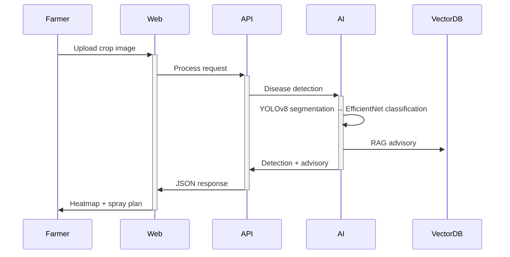

# 🏗️ System Architecture

## High-Level Flow

## Data Flow
| Stage | Input | Model | Output |
|-------|-------|--------|--------|
| 1. Leaf Detection | Crop image | YOLOv8-seg | Bounding boxes |
| 2. Disease Class | Leaf crop | EfficientNet-B0 | Disease type + confidence |
| 3. Advisory | Disease + location | RAG (PGVector) | Treatment + KVK contacts |
| 4. Spraying | Detection map | Heatmap algo | 6-lane spray pattern |
