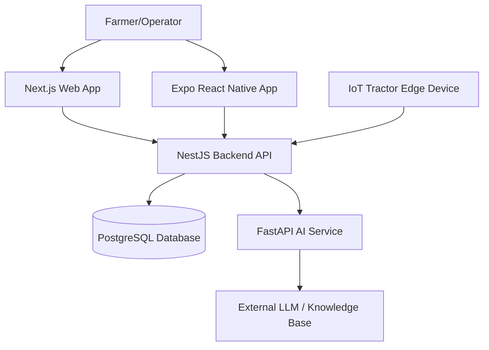

# Architecture

> Generated by /map on 2026-03-10

## Overview
KRISHI-EYE is a centralized intelligence platform for modern agriculture. It provides a web dashboard and a mobile app for farmers to manage their operations, tractor fleets, tracking real-time metrics, scheduling autonomous/semi-autonomous jobs, and getting AI-assisted agronomic advice. The system is built as a monorepo utilizing `pnpm` workspaces, dividing responsibilities into dedicated frontend applications, a foundational backend API, and a microservice architecture for AI.

## System Diagram

## Components

### 1. Web Application (`apps/web`)
- **Purpose:** Primary command center and dashboard for farmers and fleet operators.
- **Location:** `apps/web`
- **Dependencies:** React, Next.js, TailwindCSS, shadcn/ui.
- **Dependents:** Used directly by users via web browsers.

### 2. Mobile Application (`apps/mobile`)
- **Purpose:** On-the-go application designed with large touch targets, offline readiness, and native maps.
- **Location:** `apps/mobile`
- **Dependencies:** Expo, React Native, React Navigation.
- **Dependents:** Field operators and farmers via iOS/Android devices.

### 3. Backend API (`apps/api`)
- **Purpose:** Core relational logic, entity management (Farms, Tractors, Jobs, Telemetry), JWT authentication (with OTP), rate-limiting, and data querying.
- **Location:** `apps/api`
- **Dependencies:** NestJS, TypeORM (legacy context), Prisma (active ORM), SQLite (fallback), PostgreSQL.
- **Dependents:** Consumed by Web App, Mobile App, and ingested from hardware edge devices.

### 4. AI Advisory Service (`apps/ai-service`)
- **Purpose:** Intelligent agricultural advisory system for farmers to troubleshoot machinery or request agronomic intelligence.
- **Location:** `apps/ai-service`
- **Dependencies:** Python, FastAPI, Uvicorn, Pydantic.
- **Dependents:** Polled internally by the Backend API proxy routes.

### 5. Shared Packages (`packages/*`)
- **Purpose:** Shared utilities and definitions preventing code duplication across the monorepo.
- **Location:** `packages/types`, `packages/ui`, `packages/api-client`, etc.
- **Dependencies:** Varies slightly per package.
- **Dependents:** All apps in the workspace.

## Data Flow
1. **IoT / Telemetry Ingestion:** Tractors broadcast geometry (WKT), speed, and job progression metrics to `/telemetry` endpoints in the `api`.
2. **User Control and Read:** Web and Mobile interfaces fetch job telemetry via the API's analytics dashboards to display to the user.
3. **AI Resolution:** Users submit text feedback or agronomic queries from Web/Mobile; the global API proxies the requests to the `ai-service`, querying RAG context and sending the response back cleanly.

## Integration Points
| External Service | Type | Purpose |
|------------------|------|---------|
| PostgreSQL | Database | Primary relational datastore (Farms, Users, Tractors, Jobs). |
| SQLite | Database | File-based fallback specifically for local/demo runs. |
| External LLMs | API | The AI-service calls an external LLM for grounded knowledge. |

## Conventions
- **Naming:** standard `kebab-case` for files/folders, `PascalCase` for React components/NestJS classes, `camelCase` for variables.
- **Structure:** Vertical slicing inside NestJS (modules contain controllers, services, dtos, entities alongside). Monorepo separates domain-bounded contexts via `apps/` and `packages/`.
- **Testing:** Jest for E2E tests (`test/*.e2e-spec.ts`) in the API, `pytest` for the `ai-service`.

## Technical Debt
- [ ] **Phase 1 (Tests):** Implement fully documented API end-to-end Test Matrix.
- [ ] **Phase 1 (Web):** Need to implement the "how this helped" summary panel and detailed metrics in the mobile app `tabs/index.tsx`.
- [ ] **Phase 2 (Dependencies):** Several sub-dependencies in `node_modules` flag as deprecated, requiring periodic standard dependency audits (e.g., `npm audit` or `pnpm audit`).
- [ ] **TypeORM vs Prisma Mix:** The codebase recently migrated to Prisma but retains some TypeORM dependencies in `package.json`. Need to clean out legacy TypeORM usage/configuration if entirely obsolete.
