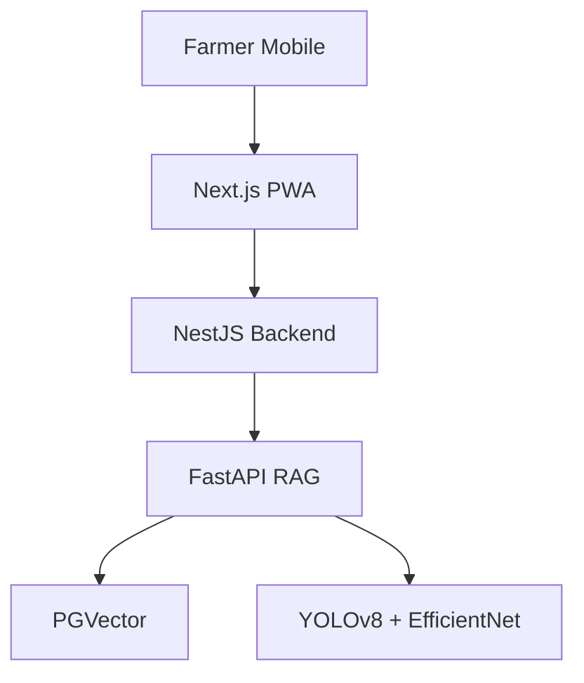

# KRISHI-EYE 🚜 Precision Agriculture Platform

**AI-powered boom sprayer for Indian farmers** - Real-time disease detection + targeted spraying + agronomy advisory.

## 🎯 Features
- **Disease Detection** - YOLOv8 + EfficientNet (95%+ accuracy)
- **Precision Spraying** - Heatmap-based 6-lane boom simulation
- **Agri Advisory** - RAG-powered recommendations w/ ICAR/KVK contacts
- **Multi-language** - English + 10 Indian languages
- **Mobile-first** - PWA ready

## 🏗️ Architecture

See [ARCHITECTURE.md](ARCHITECTURE.md)

## 🚀 Quick Start
```bash
# Clone & install
git clone https://github.com/soham25-git/KRISHI-EYE_Webapp-India-Innovates_Open-Innovation.git
cd KRISHI-EYE_Webapp-India-Innovates_Open-Innovation

# Backend (Render)
cd apps/api && npm i && npm run start:prod

# Frontend (Vercel)
cd apps/web && npm i && npm run dev
```

## 🛠️ Tech Stack
See [TECH-STACK.md](TECH-STACK.md)

## 📱 Live Demo
- Frontend: [vercel-url]
- Backend: [render-url]
- Heatmap Simulator: [demo-link]

## 📄 License
MIT © Soham Rangnekar
