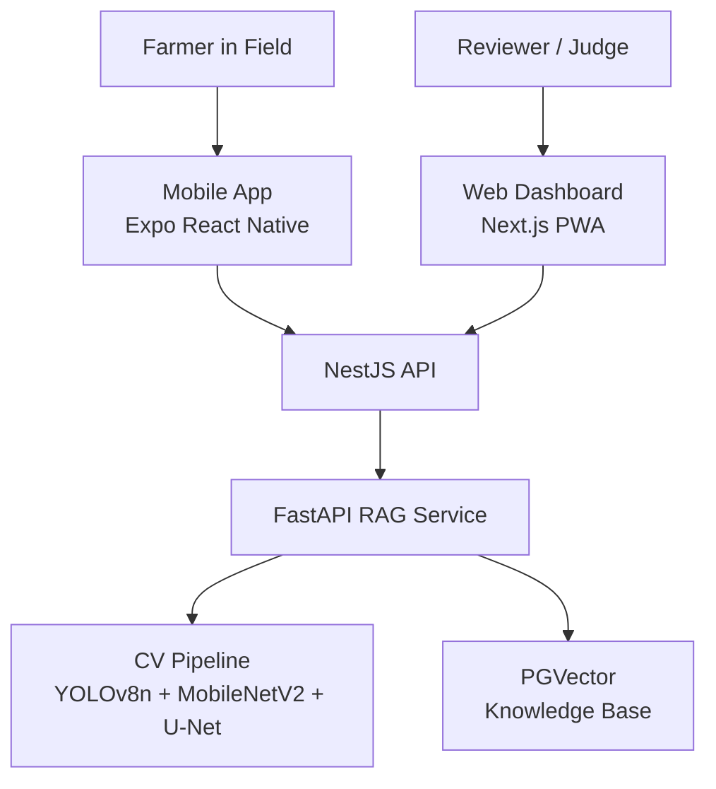

# KRISHI-EYE 🌾 Precision Agriculture Platform

Mobile-first precision agriculture platform for Indian farmers, with a companion web dashboard for monitoring, demonstrations, and review. KRISHI-EYE integrates computer vision–driven disease detection with a boom-sprayer system to enable targeted, efficient crop treatment.

## 🎯 Primary Interfaces

| Interface | Purpose | Technology |
|-----------|---------|------------|
| **Mobile App** | Farmer-facing field tool — capture, detect, advise | Expo 55 (React Native 0.83) |
| **Web Dashboard** | Monitoring, demo, and review interface | Next.js 14+ (React 19, App Router) |

Both clients share a common backend API and AI service.

## 🔬 Computer Vision Pipeline

KRISHI-EYE uses a multi-stage vision pipeline for disease detection and targeted spraying:

1. **Leaf Segmentation** — YOLOv8n-seg isolates individual leaves from field imagery
2. **Infection Classification** — MobileNetV2 classifies detected leaves by disease type
3. **Lesion Area Segmentation** — U-Net segments the precise lesion boundaries within infected leaves
4. **Targeted Spraying** — Detection results drive a 6-lane boom-sprayer heatmap for precision application

## 🚜 Core Capabilities

- **Disease Detection** — Multi-stage CV pipeline (segment → classify → localize)
- **Precision Spraying** — Heatmap-based 6-lane boom simulation for targeted treatment
- **Agri Advisory** — RAG-powered recommendations with ICAR/KVK source citations
- **Help Directory** — Verified Indian agricultural support contacts (KVKs, ICAR centres, helplines)
- **Offline-Ready** — PWA and local-first mobile architecture

## 🏗️ Architecture



See [ARCHITECTURE.md](ARCHITECTURE.md) for detailed flow diagrams.

## 📁 Repository Structure

```
apps/
├── mobile/       # Expo React Native — farmer-facing mobile app
├── web/          # Next.js — web dashboard and demo interface
├── api/          # NestJS — backend API
└── ai-service/   # FastAPI — RAG advisory + CV inference
packages/
└── types/        # Shared TypeScript types
```

## 🚀 Quick Start

```bash
git clone https://github.com/soham25-git/KRISHI-EYE_Webapp-India-Innovates_Open-Innovation.git
cd KRISHI-EYE_Webapp-India-Innovates_Open-Innovation

# Backend API
cd apps/api && npm install && npm run start:dev

# Web Dashboard
cd apps/web && npm install && npm run dev

# Mobile App
cd apps/mobile && npm install && npx expo start
```

## 🛠️ Tech Stack

See [TECH-STACK.md](TECH-STACK.md)

## 📄 License

MIT © Soham Rangnekar
